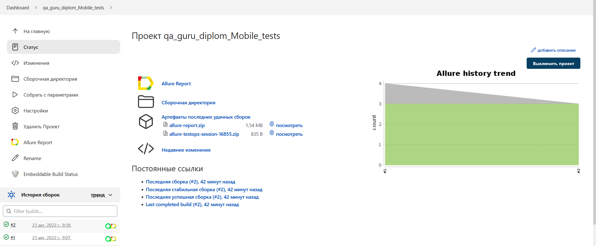
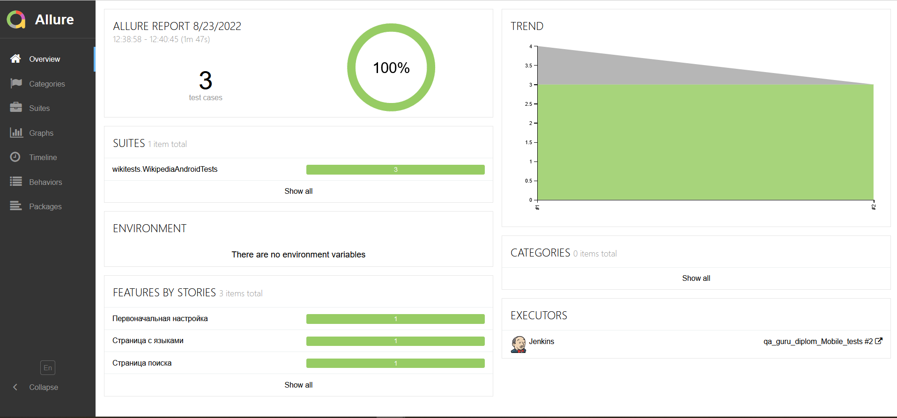
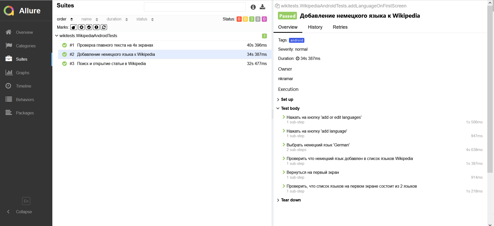
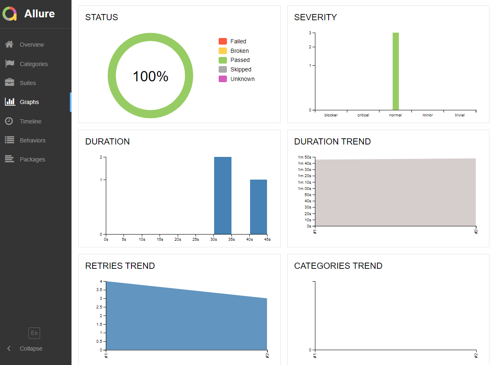
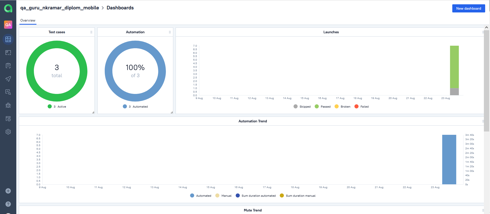
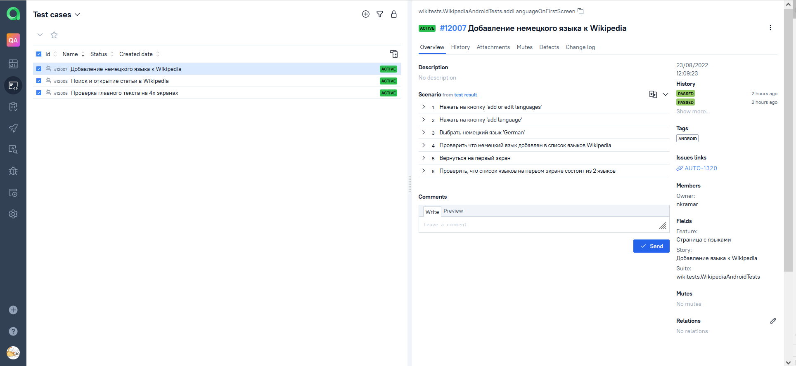
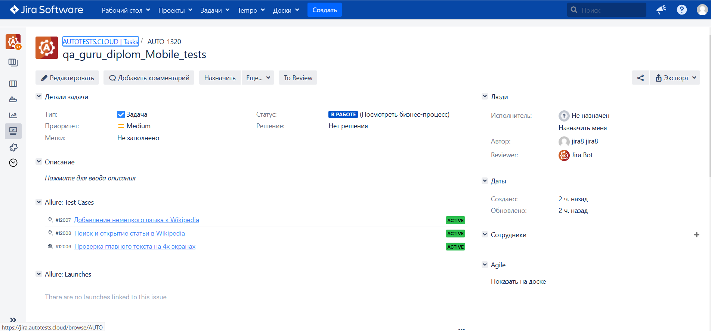
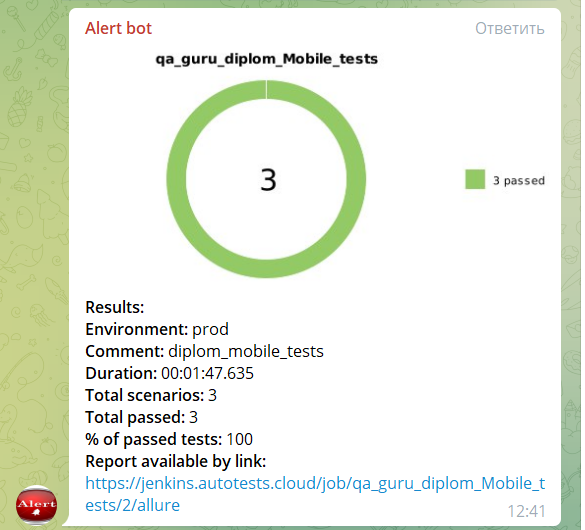

<h2 align="center"> Проект по мобильной автоматизации для приложения Wikipedia <a target="_blank" href="https://www.wikipedia.org/"></a> </h2>

<p align="center">

</p>


## :green_book: *Содержание*
+ [Технологии и инструменты](#Technology)
+ [Примеры автоматизированных тест кейсов](#TestCases)
+ [Запуск тестов в Jenkins](#Jenkins)
+ [Команды для запуска из терминала](#SystemProperty)
+ [Отчет о результатах тестирования в Allure Report](#AllureReport)
+ [Интеграция с Allure TestOps](#AllureTestOps)
+ [Интеграция с Jira](#Jira)
+ [Уведомление в Telegram при помощи Alert bot](#Telegram)
+ [Пример видео выполнения теста на сервере BrowserStack](#BrowserStack)

____
# <a name="Technology">*Технологии и инструменты*</a>

<p align="center">  
<a href="https://www.jetbrains.com/idea/"></a>  
<a href="https://www.java.com/"></a>  
<a href="https://github.com/"></a>  
<a href="https://junit.org/junit5/"></a>  
<a href="https://gradle.org/"></a>  
<a href="https://selenide.org/"></a>  
<a href="https://github.com/appium/appium-inspector/raw/main/docs/icon.png"></a>  
<a href="https://github.com/allure-framework/allure2"></a> 
<a href="https://qameta.io/"></a>   
<a href="https://avatars.githubusercontent.com/u/3221291?s=200&v=4"></a>  
<a href="https://cdn.worldvectorlogo.com/logos/android-studio-1.svg"></a>  
<a href="https://www.jenkins.io/"></a>  
<a href="https://www.atlassian.com/ru/software/jira/"></a>  
</p>

____
# <a name="TestCases">*Примеры автоматизированных тест кейсов*</a>

- :white_check_mark: Проверка добавления дополнительного языка в Wikipedia
- :white_check_mark: Проверка текста на стартовом экране
- :white_check_mark: Проверка функции поиска по тексту

____

#  </a> <a name="Jenkins">*Запуск тестов в Jenkins*</a>

<a target="_blank" href="https://jenkins.autotests.cloud/job/qa_guru_diplom_Mobile_tests/">**Сборка в Jenkins**</a>
<p align="center">  
<a href="https://jenkins.autotests.cloud/job/qa_guru_diplom_Mobile_tests/"></a>  
</p>


____
# <a name="SystemProperty">*Команды для запуска из терминала*</a>

***Локальный запуск:***
```bash  
gradle clean android_tests -DdeviceHost=${DEVICEHOST}
```

***Удалённый запуск через Jenkins:***
```bash  
gradle clean android_tests -DdeviceHost=${DEVICEHOST}
```

# <a name="AllureReport">*Отчет о результатах тестирования в Allure Report*</a>

## </a> *Allure* <a target="_blank" href="https://jenkins.autotests.cloud/job/qa_guru_diplom_Mobile_tests/">*отчёт*</a>
___

### *Основная страница отчёта*

<p align="center">  
  
</p>  

### *Тест кейсы*

<p align="center">  
  
</p>

### *Графики*

  <p align="center">  
  
</p>

___

#  <a name="AllureTestOps">*Интеграция с Allure TestOps*</a>

## </a>*TestOps* <a target="_blank" href="https://allure.autotests.cloud/launch/15409/tree/155295?treeId=0">*Dashboard*</a>

<p align="center">  
  
</p>  

## *Тест кейсы*

<p align="center">  
  
</p>

___

#  <a name="Jira">*Интеграция с Jira*</a>

## </a>*Тикет в* <a target="_blank" href="https://jira.autotests.cloud/browse/AUTO-1320">*Jira*</a>

<p align="center">  
  
</p>

____
#  <a name="Telegram">*Уведомление в Telegram при помощи Alert bot*</a>


<p align="center">  
  
</p>

#  <a name="BrowserStack">Пример видео выполнения теста на BrowserStack</a>

<p align="center"> 
   
</p>


